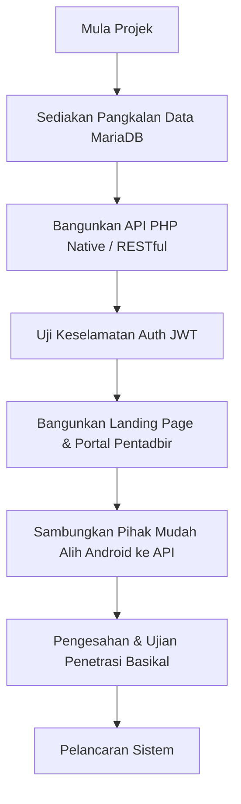

# Dokumen Keperluan Produk (PRD)
## Backend, API & Portal Pentadbir Rubber Clone AI

Sistem **Rubber Clone AI** ialah inisiatif berasaskan AI menggunakan Google Gemini untuk membantu pekebun kecil RISDA dan pegawai lapangan mengenalpasti klon getah melalui imbasan daun. Dokumen ini memperincikan keperluan bagi membina backend berpusat (PHP + MariaDB), API untuk aplikasi mudah alih Android, Portal Pentadbir (Admin Web Portal), dan Halaman Utama Awam (Landing Page).

---

## 1. Ringkasan Eksekutif & Objektif

### 1.1 Latar Belakang
Aplikasi mudah alih Rubber Clone AI kini berfungsi secara luar talian dengan penyimpanan sejarah imbasan tempatan (Room Database) serta integrasi terus ke Gemini API menggunakan kunci API tempatan. Untuk meningkatkan kawalan peranti, pengurusan data, dan pemantauan di peringkat agensi (RISDA), sistem ini memerlukan backend berpusat.

### 1.2 Objektif Projek
*   **Penyimpanan Berpusat**: Memindahkan data imbasan daripada peranti mudah alih ke pangkalan data awan berpusat untuk mengelakkan kehilangan data.
*   **Pengesahan Pengguna (Auth)**: Menyediakan fungsi pendaftaran dan log masuk asas bagi pegawai RISDA dan pekebun kecil.
*   **Kawalan Pentadbir**: Membolehkan pentadbir RISDA memantau semua aktiviti, mengaktifkan/menyahaktifkan pengguna, dan melihat statistik masa nyata.
*   **Saluran Maklumat (Landing Page)**: Menyediakan portal awam yang memaparkan kelebihan aplikasi dan menyediakan pautan muat turun fail APK.

---

## 2. Struktur Pangkalan Data (MariaDB)

Pangkalan data akan menggunakan MariaDB. Berikut adalah skema jadual yang dicadangkan:

### 2.1 Jadual: `users`
Menyimpan maklumat akaun pengguna dan pentadbir.

```sql
CREATE TABLE `users` (
  `id` INT AUTO_INCREMENT PRIMARY KEY,
  `email` VARCHAR(100) UNIQUE NOT NULL,
  `username` VARCHAR(50) UNIQUE NOT NULL,
  `password_hash` VARCHAR(255) NOT NULL,
  `fullname` VARCHAR(150) NOT NULL,
  `agency` VARCHAR(100) DEFAULT 'RISDA Pekebun Kecil',
  `status` ENUM('active', 'inactive') DEFAULT 'active',
  `role` ENUM('user', 'admin') DEFAULT 'user',
  `registration_date` BIGINT NOT NULL, -- Unix timestamp (milisaat) sepadan dengan Android client
  `created_at` TIMESTAMP DEFAULT CURRENT_TIMESTAMP,
  `updated_at` TIMESTAMP DEFAULT CURRENT_TIMESTAMP ON UPDATE CURRENT_TIMESTAMP
);
```

### 2.2 Jadual: `analysis_records`
Menyimpan sejarah imbasan dan analisis daun getah oleh pengguna.

```sql
CREATE TABLE `analysis_records` (
  `id` INT AUTO_INCREMENT PRIMARY KEY,
  `user_id` INT NOT NULL,
  `clone_name` VARCHAR(100) NOT NULL,
  `confidence` FLOAT NOT NULL,
  `timestamp` BIGINT NOT NULL, -- Unix timestamp (milisaat)
  `latitude` DOUBLE NOT NULL,
  `longitude` DOUBLE NOT NULL,
  `location_name` VARCHAR(255) DEFAULT 'Stesen RISDA, Malaysia',
  `image_url` VARCHAR(255) DEFAULT NULL,
  `notes` TEXT,
  `soil_type` VARCHAR(100) DEFAULT 'Tiada Maklumat',
  `rainfall` VARCHAR(100) DEFAULT 'Tiada Maklumat',
  `elevation` VARCHAR(100) DEFAULT 'Tiada Maklumat',
  `created_at` TIMESTAMP DEFAULT CURRENT_TIMESTAMP,
  FOREIGN KEY (`user_id`) REFERENCES `users`(`id`) ON DELETE CASCADE
);
```

---

## 3. Spesifikasi API (RESTful API - PHP)

Semua tindak balas API (API response) mestilah menggunakan format **JSON** dengan pengepala `Content-Type: application/json`. Pengesahan akses menggunakan **JWT (JSON Web Token)** atau token pembawa (**Bearer Token**) yang dihantar dalam pengepala `Authorization`.

### 3.1 Laluan Pengesahan (Auth Endpoints)

#### a) Pendaftaran Pengguna (`POST /api/auth/register.php`)
*   **Akses**: Awam
*   **Permintaan (Body)**:
    ```json
    {
      "email": "user@risda.gov.my",
      "username": "risda_user",
      "password": "Password123",
      "fullname": "Ahmad Bin Kasim",
      "agency": "RISDA Perak"
    }
    ```
*   **Tindak Balas (Success - 201 Created)**:
    ```json
    {
      "status": "success",
      "message": "Pengguna berjaya didaftarkan."
    }
    ```

#### b) Log Masuk (`POST /api/auth/login.php`)
*   **Akses**: Awam
*   **Permintaan (Body)**:
    ```json
    {
      "email": "user@risda.gov.my",
      "password": "Password123"
    }
    ```
*   **Tindak Balas (Success - 200 OK)**:
    ```json
    {
      "status": "success",
      "token": "eyJhbGciOiJIUzI1NiIsInR5cCI6IkpXVCJ9...",
      "user": {
        "id": 2,
        "email": "user@risda.gov.my",
        "username": "risda_user",
        "fullname": "Ahmad Bin Kasim",
        "agency": "RISDA Perak",
        "role": "user",
        "status": "active"
      }
    }
    ```
*   **Tindak Balas (Sekatan Pentadbir - 403 Forbidden)**:
    Jika status pengguna ialah `inactive`:
    ```json
    {
      "status": "error",
      "message": "Akaun anda telah dinyahaktifkan oleh Pentadbir RISDA. Sila hubungi pihak pengurusan."
    }
    ```

---

### 3.2 Laluan Analisis Daun (Analysis Endpoints)

#### a) Simpan Rekod Imbasan (`POST /api/analysis/upload.php`)
*   **Akses**: Pengguna Log Masuk (User/Admin)
*   **Pengepala**: `Authorization: Bearer <token>`
*   **Permintaan (Multipart Form Data / JSON)**:
    ```json
    {
      "clone_name": "RRIM 3001",
      "confidence": 0.94,
      "timestamp": 1718380800000,
      "latitude": 4.5921,
      "longitude": 101.0901,
      "location_name": "Tapak Semaian RISDA Ipoh",
      "notes": "Struktur daun sihat, bentuk eliptik simetri.",
      "soil_type": "Tanah Liat Berpasir",
      "rainfall": "2,200 mm",
      "elevation": "120 meter"
    }
    ```
    *(Pilihan: Sertakan fail imej `image` untuk disimpan di pelayan backend dan dapatkan `image_url`)*
*   **Tindak Balas (Success - 201 Created)**:
    ```json
    {
      "status": "success",
      "message": "Rekod analisis berjaya disimpan.",
      "data": {
        "id": 45,
        "clone_name": "RRIM 3001",
        "image_url": "https://api.rubberclone.risda.gov.my/uploads/images/scan_45.jpg"
      }
    }
    ```

#### b) Dapatkan Sejarah Imbasan (`GET /api/analysis/list.php`)
*   **Akses**: Pengguna Log Masuk
*   **Pengepala**: `Authorization: Bearer <token>`
*   **Logik Backend**:
    *   Jika pengguna ialah **`user`**, pulangkan rekod analisis kepunyaan `user_id` mereka sahaja.
    *   Jika pengguna ialah **`admin`**, pulangkan **SEMUA** rekod analisis daripada semua pengguna dalam sistem.
*   **Tindak Balas (Success - 200 OK)**:
    ```json
    {
      "status": "success",
      "data": [
        {
          "id": 45,
          "username": "risda_user",
          "fullname": "Ahmad Bin Kasim",
          "clone_name": "RRIM 3001",
          "confidence": 0.94,
          "timestamp": 1718380800000,
          "latitude": 4.5921,
          "longitude": 101.0901,
          "location_name": "Tapak Semaian RISDA Ipoh",
          "notes": "Struktur daun sihat",
          "soil_type": "Tanah Liat Berpasir",
          "rainfall": "2,200 mm",
          "elevation": "120 meter",
          "image_url": "https://api.rubberclone.risda.gov.my/uploads/images/scan_45.jpg"
        }
      ]
    }
    ```

#### c) Padam Rekod Imbasan (`DELETE /api/analysis/delete.php?id={id}`)
*   **Akses**: Pengguna Terlibat / Admin
*   **Pengepala**: `Authorization: Bearer <token>`
*   **Tindak Balas (Success - 200 OK)**:
    ```json
    {
      "status": "success",
      "message": "Rekod berjaya dipadamkan."
    }
    ```

#### d) Kosongkan Semua Sejarah (`POST /api/analysis/clear.php`)
*   **Akses**: Pengguna Log Masuk
*   **Pengepala**: `Authorization: Bearer <token>`
*   **Logik**: Memadam semua rekod milik pengguna semasa sahaja. Admin tidak boleh menggunakan endpoint ini secara global tanpa sengaja.
*   **Tindak Balas (Success - 200 OK)**:
    ```json
    {
      "status": "success",
      "message": "Semua sejarah imbasan anda telah dibersihkan."
    }
    ```

---

### 3.3 Laluan Pentadbiran (Admin Endpoints)

#### a) Senarai Pengguna (`GET /api/admin/users.php`)
*   **Akses**: Pentadbir Sahaja (`role = admin`)
*   **Pengepala**: `Authorization: Bearer <token>`
*   **Tindak Balas (Success - 200 OK)**:
    ```json
    {
      "status": "success",
      "data": [
        {
          "id": 2,
          "email": "user@risda.gov.my",
          "username": "risda_user",
          "fullname": "Ahmad Bin Kasim",
          "agency": "RISDA Perak",
          "status": "active",
          "total_scans": 15,
          "registration_date": 1718380000000
        }
      ]
    }
    ```

#### b) Kemas Kini Status Pengguna (`POST /api/admin/toggle_user.php`)
*   **Akses**: Pentadbir Sahaja
*   **Pengepala**: `Authorization: Bearer <token>`
*   **Permintaan (Body)**:
    ```json
    {
      "user_id": 2,
      "status": "inactive" // active ATAU inactive
    }
    ```
*   **Tindak Balas (Success - 200 OK)**:
    ```json
    {
      "status": "success",
      "message": "Status akaun pengguna telah dikemas kini kepada inactive."
    }
    ```

#### c) Statistik Global Pentadbir (`GET /api/admin/stats.php`)
*   **Akses**: Pentadbir Sahaja
*   **Pengepala**: `Authorization: Bearer <token>`
*   **Tindak Balas (Success - 200 OK)**:
    ```json
    {
      "status": "success",
      "data": {
        "summary": {
          "total_users": 142,
          "active_users": 138,
          "total_scans": 1824,
          "scans_today": 34
        },
        "scans_by_clone": [
          { "clone_name": "RRIM 600", "count": 520 },
          { "clone_name": "RRIM 3001", "count": 412 },
          { "clone_name": "PB 260", "count": 310 }
        ],
        "scans_by_agency": [
          { "agency": "RISDA Perak", "count": 680 },
          { "agency": "RISDA Johor", "count": 540 }
        ],
        "scans_geographic": [
          { "latitude": 4.5921, "longitude": 101.0901, "clone_name": "RRIM 3001", "user": "Ahmad Bin Kasim" }
        ]
      }
    }
    ```

---

## 4. Reka Bentuk Portal Pentadbir (Admin Web Portal)

Web Portal Pentadbir dibina menggunakan **Vanilla HTML, CSS (Glassmorphism + Dark Mode)**, dan **JavaScript**. Halaman utama portal ini direka bentuk supaya kelihatan profesional dan berteknologi tinggi.

### 4.1 Ciri-Ciri Portal Pentadbir
1.  **Papan Pemuka (Dashboard)**:
    *   *Kad Metrik Pintar*: Memaparkan Total Scans, Active Users, Inactive Users, dan Scans Today.
    *   *Grafik Visual*: Menggunakan pustaka ringan seperti **Chart.js** untuk menunjukkan statistik imbasan klon getah (Bar Chart) dan perbandingan prestasi mengikut agensi negeri (Pie Chart).
    *   *Peta Lokasi Tapak Semai*: Peta interaktif (LeafletJS - Sumber Terbuka) yang memaparkan penanda (markers) lokasi geografi di mana daun getah diimbas.
2.  **Pengurusan Pengguna (User Directory)**:
    *   Senarai lengkap pengguna dalam bentuk jadual responsive.
    *   Carian (Search) mengikut Nama, E-mel, atau Agensi.
    *   Butang togol/suis pintar **"Enable/Disable"** (Aktif/Nyahaktif) untuk menyekat akses pengguna dengan kemas kini status masa nyata melalui panggilan Fetch API backend.
3.  **Audit Data Imbasan (Global Analysis History)**:
    *   Senarai semua data daun yang telah dianalisis di seluruh Malaysia.
    *   Fungsi filter mengikut nama klon getah, tahap keyakinan (confidence score), atau tarikh imbasan.
    *   Kemungkinan untuk melihat imej daun yang dimuat naik berserta catatan terperinci AI Gemini.

---

## 5. Halaman Utama Awam (Landing Page)

Halaman utama (Landing Page) dibina bertemakan identiti RISDA Malaysia dengan suntikan estetika premium, moden, dan mesra alam (skema warna hijau hutan, hijau pudina, kelabu gelap, dan emas susu getah).

### 5.1 Struktur Kandungan Landing Page
1.  **Hero Banner**:
    *   Tajuk utama yang memukau: *"Pengecaman Klon Getah RISDA Pintar Menggunakan Kuasa AI"*
    *   Tangkap skrin mockup telefon pintar yang memaparkan aplikasi Rubber Clone AI.
    *   Butang CTA (Call-To-Action): **"Muat Turun APK Mudah Alih"** (pautan ke fail APK yang dihoskan) dan **"Log Masuk Pentadbir"** (pautan ke Admin Web Portal).
2.  **Ciri-Ciri Sistem (Key Features)**:
    *   *AI Multimodal*: Penerangan ringkas bagaimana AI Gemini menganalisis morfologi daun getah.
    *   *Geo-Tagging Pintar*: Mengaitkan imbasan dengan koordinat GPS untuk membina peta taburan klon getah RISDA.
    *   *Agro-Kesesuaian*: Memberi cadangan tanah, ketinggian, dan taburan hujan berasaskan panduan rasmi RISDA.
3.  **Cara Penggunaan**:
    *   Langkah 1: Tangkap foto daun pokok getah menggunakan kamera aplikasi.
    *   Langkah 2: AI memproses imej dan membandingkannya dengan pangkalan data klon getah RISDA.
    *   Langkah 3: Dapatkan cadangan agronomi pintar untuk mengoptimumkan hasil lateks.
4.  **Statistik Semasa**:
    *   Kaunter dinamik: Bilangan imbasan aktif di seluruh negara, jumlah klon disokong, dan jumlah pegawai lapangan berdaftar.
5.  **Kaki Halaman (Footer)**:
    *   Pautan ke portal rasmi RISDA Malaysia, terma penggunaan aplikasi, dan maklumat hak cipta terpelihara.

---

## 6. Reka Bentuk Estetika (Design System)

Semua komponen web (Landing Page & Admin Portal) hendaklah mematuhi parameter estetika berikut:

*   **Palet Warna**:
    *   `Forest Dark` (Latar Belakang): `#0D1B15` (Hijau gelap pekat)
    *   `Emerald Accent` (Aksen Utama): `#10B981` (Hijau zamrud cerah)
    *   `Mint Light` (Teks/Elemen): `#ECFDF5`
    *   `Gold Latex` (Highlight Khas): `#F59E0B` (Emas amber hangat mewakili nilai komersial getah)
*   **Tipografi**:
    *   Fon Utama: **Inter** atau **Outfit** daripada Google Fonts untuk paparan moden yang bersih.
*   **Kesan Glassmorphism**:
    *   Gunakan `backdrop-filter: blur(12px)` dengan sempadan lutsinar tipis `rgba(255, 255, 255, 0.05)` untuk menghasilkan kesan panel kaca premium pada papan pemuka dan kad ciri.

---

## 7. Pelan Pelaksanaan & Peringkat Pembangunan



### 7.1 Fasa 1: Backend & Database (Minggu 1)
*   Menyiapkan persekitaran MariaDB dan membina jadual `users` serta `analysis_records`.
*   Menulis skrip PHP untuk pendaftaran, log masuk, dan penghasilan token JWT.
*   Membolehkan API menerima muat naik imej daun secara selamat.

### 7.2 Fasa 2: Portal Pentadbir & Landing Page (Minggu 2)
*   Membina halaman utama awam (Landing Page) mesra SEO.
*   Membina UI Dashboard Pentadbir yang responsive dengan paparan graf interaktif menggunakan Chart.js.
*   Menyambungkan UI Portal ke API pentadbir bagi kawalan pengguna (enable/disable).

### 7.3 Fasa 3: Integrasi Android Client (Minggu 3)
*   Mengemas kini `RubberCloneRepository.kt` dan `RubberCloneViewModel.kt` untuk menukar operasi Room Database tempatan kepada panggilan API atas talian apabila talian internet aktif.
*   Melaksanakan mekanisme caching tempatan sekiranya peranti berada di luar talian (kawasan estet getah pedalaman) dan menghantar semula (sync) apabila talian internet tersedia.

---

## 8. Pelan Pengesahan & Ujian

### 8.1 Ujian API (Menggunakan Postman atau curl)
1.  **Ujian Log Masuk Pengguna Tidak Aktif**:
    *   *Senario*: Menukar status akaun pengguna kepada `inactive` dalam MariaDB. Cuba log masuk menggunakan akaun tersebut.
    *   *Keputusan Jangkaan*: Pihak pelayan memulangkan status `403 Forbidden` berserta mesej amaran.
2.  **Ujian Keselamatan Token**:
    *   *Senario*: Memanggil `GET /api/analysis/list.php` tanpa pengepala `Authorization`.
    *   *Keputusan Jangkaan*: Pihak pelayan memulangkan status `401 Unauthorized`.

### 8.2 Ujian Antaramuka Portal Pentadbir
1.  **Ujian Butang Togol Status Pengguna**:
    *   *Senario*: Klik suis enable/disable pengguna pada tabel user directory.
    *   *Keputusan Jangkaan*: Rekod dikemaskini serta-merta tanpa perlu muat semula halaman (menggunakan AJAX/Fetch), dan pengguna terbabit segera dinyahaktifkan.
2.  **Ujian Kebolehsuaian Peranti (Responsiveness)**:
    *   *Senario*: Buka Papan Pemuka di skrin telefon mudah alih.
    *   *Keputusan Jangkaan*: Jadual dan graf diselaraskan secara menegak dengan grid responsive tanpa keluar dari zon paparan.
